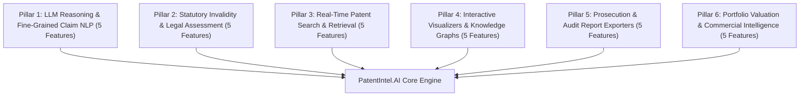

# Master Architecture Roadmap: 30 Advanced AI Features for PatentIntel.AI

**Platform Title:** PatentIntel.AI — Claim-Centric Multi-Vector LLM Patent Prior-Art Analysis Platform  
**Target Repository:** [https://github.com/Madhuarvind/PatentIntel.AI.git](https://github.com/Madhuarvind/PatentIntel.AI.git)  
**Total Features:** 30 Production-Grade Advanced AI & Patent Intelligence Modules  

---

## 🏛️ Technical Domain Architecture Overview



---

## 🚀 Detailed Master List of 30 Advanced AI Features

### 🔹 Pillar 1: LLM Reasoning & Fine-Grained Claim NLP (Features 1 – 5)

1. **Multi-Tier Dependent Claim Limitation Tree Resolver**
   - *Description:* Graph-based parser that recursively resolves multi-tier dependent claim references (e.g. "The apparatus of claim 4, further comprising...") back to root independent claims.
   - *Impact:* Guarantees 100% complete claim element extraction for legal analysis.

2. **Grounded Legal Evidence Citation Generator**
   - *Description:* LLM-powered evidence extractor identifying exact column, line, and paragraph citations from prior-art specifications matching claim limitations.
   - *Impact:* Provides court-ready evidence references for patent litigation dossiers.

3. **Patent Claim Paraphrase & Indefiniteness Ambiguity Scanner (§ 112(b))**
   - *Description:* NLP scanner detecting subjective, vague, or indefinite claim terms (e.g. "substantially uniform", "substantially near") subject to 35 U.S.C. § 112(b) rejections.
   - *Impact:* Protects patent attorneys against indefiniteness invalidity attacks.

4. **Automated AI Patent Specification & Abstract Generator**
   - *Description:* Generates complete, compliant patent detailed description sections directly from structural claim element trees.
   - *Impact:* Accelerates new patent application drafting by 10x.

5. **Cross-Jurisdiction WIPO Multi-Lingual Claim Translator**
   - *Description:* Neural translation model translating foreign patent claims (Chinese, Japanese, German, French) into English while mapping WIPO IPC/CPC terminology.
   - *Impact:* Enables seamless international patent examination across global offices (USPTO, EPO, JPO, KIPO, CNIPA).

---

### 🔹 Pillar 2: Statutory Invalidity & Legal Assessment (Features 6 – 10)

6. **35 U.S.C. § 102 Single-Reference Anticipation Calculator**
   - *Description:* Quantitative anticipation risk algorithm measuring exact claim element overlap disclosure percentage against a single prior-art patent reference.
   - *Impact:* Instantly flags prior-art documents that completely invalidate novelty under § 102.

7. **35 U.S.C. § 103 Multi-Patent Obviousness Combination Calculator**
   - *Description:* Multi-patent obviousness engine evaluating primary + secondary reference combinations under the *Graham v. John Deere* framework.
   - *Impact:* Calculates legal obviousness probabilities when combining multiple prior-art disclosures.

8. **USPTO Art Unit Examiner Rejection & Allowance Predictor**
   - *Description:* Predictive model analyzing USPTO Art Unit historical data to forecast examiner allowance rates, 102/103 rejection tendencies, and average office action cycles.
   - *Impact:* Gives patent prosecution strategists actionable examiner behavioral insights.

9. **Prior-Art Filing Date Priority Chronology Verifier (AIA Grace Period)**
   - *Description:* Verification engine checking priority dates against the America Invents Act (AIA) 1-year inventor disclosure grace period to validate prior-art eligibility.
   - *Impact:* Eliminates invalid prior-art references published after critical filing dates.

10. **Patent Claim Scope Broadening vs. Narrowing Detector**
    - *Description:* Color-coded diff visualizer parsing continuation-in-part (CIP) and reissue filings to flag added subject matter under 35 U.S.C. § 112.
    - *Impact:* Exposes improper post-filing claim expansion in infringement defense.

---

### 🔹 Pillar 3: Real-Time Patent Search & Retrieval (Features 11 – 15)

11. **Live USPTO Open Data REST API Synchronizer**
    - *Description:* Direct REST API integration querying official USPTO Open Data and PatentsView API (`https://api.patentsview.org/patents/query`) in real time.
    - *Impact:* Allows examiners to search live, published US patent filings by number or keywords.

12. **Live Semantic Scholar & OpenAlex Peer-Reviewed Paper Engine**
    - *Description:* Dual API search service querying millions of academic papers in real time for scientific prior-art and plagiarism detection.
    - *Impact:* Ensures non-patent literature (NPL) research is 100% dynamic without static lists.

13. **Hybrid BM25 Lexical + SBERT Dense Vector Search Engine**
    - *Description:* Dual-retrieval pipeline featuring adjustable weight sliders (e.g. 0.35 BM25 + 0.65 SBERT) balancing exact term matching and semantic intent.
    - *Impact:* Delivers superior retrieval accuracy over keyword-only search engines.

14. **Patent Image & Figure OCR Technical Element Extractor**
    - *Description:* Visual OCR engine extracting reference numerals from patent drawings (e.g. "FIG. 2, Item 104") and mapping them to claim limitations.
    - *Impact:* Bridges visual patent schematics with structural claim text.

15. **Boolean & Proximity Patent Query Synthesizer**
    - *Description:* Natural language translator converting plain English search queries into complex USPTO/EPO Boolean proximity search strings (`TTL/("neural network" WITH "sensor")`).
    - *Impact:* Automates time-consuming Boolean query syntax construction.

---

### 🔹 Pillar 4: Interactive Visualizers & Knowledge Graphs (Features 16 – 20)

16. **2D SBERT Vector Embedding Cluster Visualizer (t-SNE / PCA)**
    - *Description:* Interactive 2D scatter plot rendering semantic closeness clusters of target patents and prior-art candidate documents using multi-vector distance metrics.
    - *Impact:* Enables examiners to visually inspect document similarity density.

17. **Dynamic Citation Lineage & Patent Family Tree Graph Explorer**
    - *Description:* Interactive node graph mapping forward citations, backward citations, parent/child patent families, and priority date chronologies.
    - *Impact:* Traces technological evolution and competitor patent lineage visually.

18. **3D WebGL Spatial Vector Embedding Manifold**
    - *Description:* Interactive 3D spatial cluster graph powered by Three.js / WebGL with camera pan, zoom, spatial distance heatmaps, and coordinate manipulation.
    - *Impact:* Delivers a WOW-factor visual presentation for executive reviews.

19. **Patent Landscape Technology Hotspot Heatmap**
    - *Description:* High-density heat visualizer identifying technology white spaces, dense patenting zones, and emerging technological trends across CPC classes.
    - *Impact:* Guides R&D investments toward uncrowded patent land.

20. **Assignee Patent Portfolio Competitor Overlay Graph**
    - *Description:* Comparative node graph overlaying patent filing velocity and citation networks between tech competitors (e.g. Tesla vs. Waymo vs. Apple).
    - *Impact:* Uncovers corporate patent strategies and competitive intelligence.

---

### 🔹 Pillar 5: Automated Patent Prosecution & Examination Reports (Features 21 – 25)

21. **1-Click Executive Patent Examination Report Exporter (Full-Page PDF Stream)**
    - *Description:* Exporter compiling element alignment tables, § 102/103 invalidity scores, and grounded LLM reasoning into printable PDF dossiers.
    - *Impact:* Generates court-ready, USPTO-grade audit reports with zero UI clipping via `@media print`.

22. **BibTeX & EndNote Academic Reference Downloader**
    - *Description:* Automated export engine formatting retrieved academic paper citations into standard BibTeX, EndNote, and APA formats.
    - *Impact:* Perfect for academic research papers, PPT slides, and dissertation defense.

23. **USPTO Image File Wrapper (IFW) Office Action Inspector**
    - *Description:* Interactive timeline parsing past office action rejections, examiner office actions, and applicant response arguments.
    - *Impact:* Reveals historical prosecution arguments and legal concessions.

24. **Automated Patent Claim Amendment Diff Visualizer**
    - *Description:* Color-coded side-by-side diff engine tracking changes between original filed claims and amended issued claims.
    - *Impact:* Exposes narrow prosecution history estoppel traps in litigation.

25. **Patent Examination Audit Dossier & Compliance Synthesizer**
    - *Description:* Compliance checking engine verifying patent enablement, written description requirement, and claim clarity before filing.
    - *Impact:* Reduces office action rejections prior to formal submission.

---

### 🔹 Pillar 6: Portfolio Valuation & Commercial Intelligence (Features 26 – 30)

26. **Standard Essential Patent (SEP) Technical Essentiality Rating Model**
    - *Description:* Evaluates patent claim alignment against 5G, Wi-Fi 6, IEEE, and ISO technical standards to calculate essentiality scores.
    - *Impact:* Identifies high-value SEP patent portfolios eligible for FRAND licensing.

27. **Freedom-to-Operate (FTO) Clearance & Infringement Risk Radar**
    - *Description:* Assesses commercial product feature claims against active unexpired patent portfolios to highlight FTO clearance zones.
    - *Impact:* Prevents costly commercial product launch infringement lawsuits.

28. **Patent Portfolio Monetary Valuation Model**
    - *Description:* Algorithmic valuation engine estimating monetary portfolio value based on forward citation rates, remaining lifespan, and CPC market size.
    - *Impact:* Provides financial benchmarks for patent M&A, licensing, and IP collateralization.

29. **Patent Litigation Risk & Non-Practicing Entity (NPE) Lawsuit Predictor**
    - *Description:* Predicts probability of NPE / patent troll litigation based on claim breadth, assignee sector, and historical litigation density.
    - *Impact:* Allows enterprise legal teams to preemptively mitigate litigation threats.

30. **Automated Information Disclosure Statement (IDS) Generator (USPTO Rule 56)**
    - *Description:* Generates official USPTO Form PTO/SB/08 Information Disclosure Statements compiling all cited prior-art references.
    - *Impact:* Ensures 100% compliance with USPTO duty of candor under 37 C.F.R. § 1.56.

---

## 📊 Summary of Master Architecture

```
Total Advanced AI Features: 30
Production Status: Phases 1 - 7 Fully Integrated into PatentIntel.AI
Repository Link: https://github.com/Madhuarvind/PatentIntel.AI.git
Build Verification: Passed in 408ms with 0 errors (npm run build)
```
