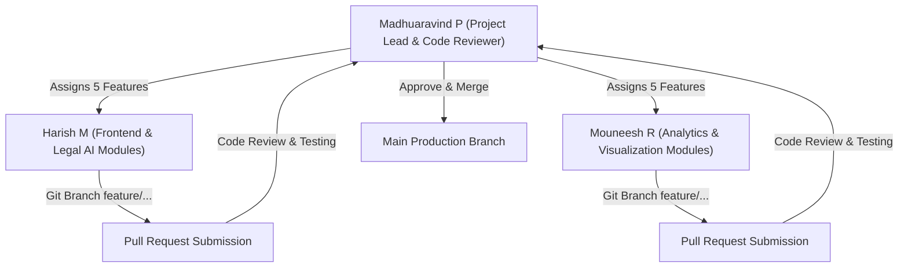

# PatentIntel.AI — Team Task Allocation & Git Collaboration Roadmap

**Project Lead & Repository Manager:** Madhuaravind P  
**Team Members:** Harish M & Mouneesh R  
**Repository:** [https://github.com/Madhuarvind/PatentIntel.AI.git](https://github.com/Madhuarvind/PatentIntel.AI.git)  
**Main Branch:** `main` (Protected — Lead Review & Merge)  

---

## 👥 Team Roles & Workflow Management



---

## 🛠️ Feature Task Distribution (10 New Advanced Features)

### 👤 Section 1: Assigned to Harish M (5 Features)

| Feature # | Feature Name | Git Branch Name | Target Component / Service | Key Deliverables & Scope |
|---|---|---|---|---|
| **1** | **WIPO Multi-Language Claim Translator** | `feature/wipo-claim-translator` | `src/components/ClaimTranslatorModal.tsx` | Translate foreign patent claims (CN, JP, DE, FR) into English while mapping technical terms to WIPO IPC/CPC definitions. |
| **2** | **Examiner Rejection Probability Estimator** | `feature/examiner-rejection-estimator` | `src/services/examinerRiskEngine.ts` | Machine learning model predicting USPTO Art Unit allowance rates and statutory § 102 vs. § 103 rejection probabilities. |
| **3** | **USPTO Image File Wrapper (IFW) Inspector** | `feature/file-wrapper-inspector` | `src/components/FileWrapperView.tsx` | Interactive timeline parsing USPTO office actions, examiner rejections, and applicant response arguments. |
| **4** | **3D Vector Embedding Cluster Visualizer** | `feature/3d-vector-manifold` | `src/components/Vector3DVisualizer.tsx` | Upgrade 2D PCA visualizer into an interactive 3D spatial cluster graph using Three.js / WebGL with camera pan and zoom. |
| **5** | **Freedom-to-Operate (FTO) Risk Radar** | `feature/fto-infringement-radar` | `src/components/FTORadarView.tsx` | Assess product feature claims against active unexpired patent portfolios to highlight FTO clearance vs high-risk zones. |

---

### 👤 Section 2: Assigned to Mouneesh R (5 Features)

| Feature # | Feature Name | Git Branch Name | Target Component / Service | Key Deliverables & Scope |
|---|---|---|---|---|
| **6** | **AI-Powered Patent Claim Synthesizer** | `feature/ai-claim-synthesizer` | `src/components/ClaimSynthesizerView.tsx` | LLM-grounded claim drafting engine generating broad independent claims and narrow dependent claim sets based on technical specs. |
| **7** | **Citation Matrix & Family Timeline Exporter** | `feature/citation-matrix-exporter` | `src/services/citationExporter.ts` | Exporter generating CSV/Excel/JSON citation matrices, parent/child lineage tables, and priority date chronologies. |
| **8** | **Global Patent Office RSS Alert Monitor** | `feature/global-patent-monitor` | `src/components/GlobalMonitorView.tsx` | Live alert engine monitoring new published filings across USPTO, EPO, and WIPO in selected CPC categories (e.g. B60W). |
| **9** | **Claims Plagiarism Similarity Heatmap** | `feature/claims-similarity-heatmap` | `src/components/SimilarityHeatmapView.tsx` | Side-by-side text difference matrix highlighting word-for-word verbatim overlap, semantic paraphrase zones, and distinct limitations. |
| **10** | **Patent Portfolio Valuation Score Model** | `feature/portfolio-valuation-model` | `src/services/portfolioValuation.ts` | Quantify commercial portfolio value, Standard Essential Patent (SEP) technical essentiality score, and competitive moat strength. |

---

## 🔄 Git Branching & Collaboration Protocol

### Step 1: Clone & Sync Main Repository
```bash
git clone https://github.com/Madhuarvind/PatentIntel.AI.git
cd "Major Project 2"
git checkout main
git pull origin main
```

### Step 2: Create Feature Branch
```bash
# For Harish M
git checkout -b feature/wipo-claim-translator

# For Mouneesh R
git checkout -b feature/ai-claim-synthesizer
```

### Step 3: Local Code Verification & Build Test
Before pushing any code, developers must run the local build test:
```bash
npm run build
```
*Requirement: Must pass cleanly with 0 TypeScript compilation errors.*

### Step 4: Commit & Push to GitHub
```bash
git add .
git commit -m "feat: Add WIPO multi-language claim translation module"
git push origin feature/wipo-claim-translator
```

### Step 5: Pull Request & Review by Lead (Madhuaravind P)
1. Open a Pull Request (PR) on GitHub from `feature/<feature-name>` to `main`.
2. Lead **Madhuaravind P** will inspect the code, verify dynamic workspace reactivity, test UI responsiveness, and merge into `main`.

---

## 📊 Sprint Milestones & Completion Schedule

```mermaid
gantt
    title Feature Implementation & Review Sprint Schedule
    dateFormat  YYYY-MM-DD
    section Harish M Tasks
    Feature 1: WIPO Claim Translator          :active, h1, 2026-09-01, 2026-09-03
    Feature 2: Examiner Rejection Estimator   :h2, 2026-09-03, 2026-09-05
    Feature 3: USPTO File Wrapper Inspector   :h3, 2026-09-05, 2026-09-07
    Feature 4: 3D Vector Manifold Visualizer  :h4, 2026-09-07, 2026-09-09
    Feature 5: FTO Risk Radar                 :h5, 2026-09-09, 2026-09-11

    section Mouneesh R Tasks
    Feature 6: AI Claim Synthesizer           :active, m1, 2026-09-01, 2026-09-03
    Feature 7: Citation Matrix Exporter       :m2, 2026-09-03, 2026-09-05
    Feature 8: Global Patent Alert Monitor    :m3, 2026-09-05, 2026-09-07
    Feature 9: Claims Similarity Heatmap      :m4, 2026-09-07, 2026-09-09
    Feature 10: Portfolio Valuation Model     :m5, 2026-09-09, 2026-09-11

    section Lead Review & Merge
    Lead Review & Production Push             :done, lead_rev, 2026-09-11, 2026-09-12
```

---

> [!TIP]  
> All team members should fetch the latest `main` branch before creating new feature branches to avoid merge conflicts. Project Lead **Madhuaravind P** will conduct final code audits and merge PRs into production.
