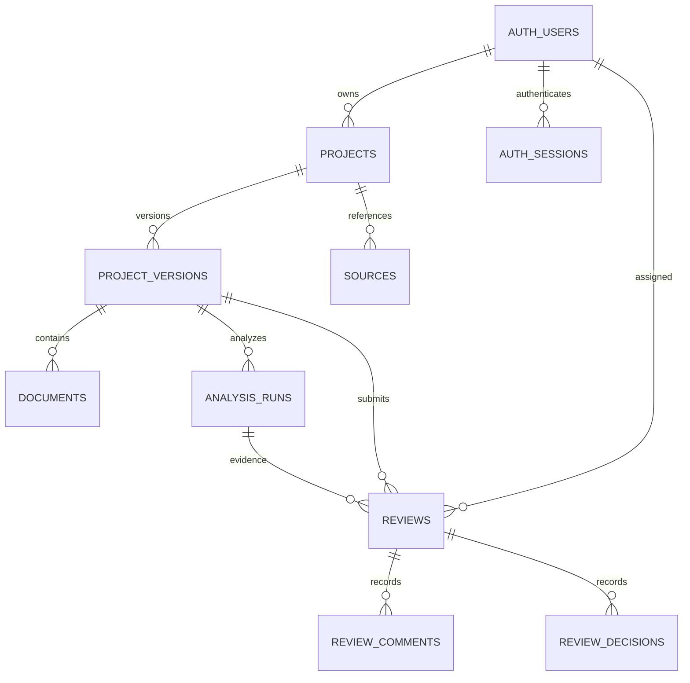
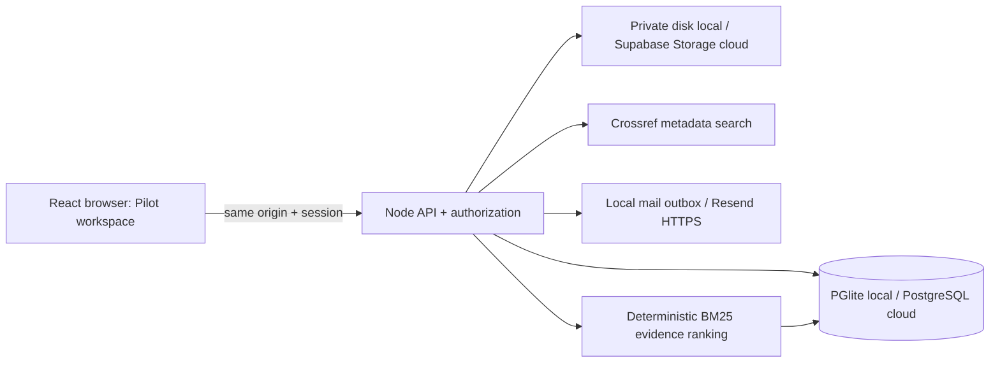

# Pilot requirements and design — 2 October 2026

Status: local implementation and verification in progress; hosted acceptance is NOT certified. This document supersedes the legacy research drafts as a statement of delivered scope.

## Objective and requirements traceability

The release supports researcher → proposal → evidence → assigned reviewer → revision → decision → export. English text and text PDFs are supported; OCR, model training, semantic search, legal screening, vision and claim generation are deferred.

| ID | Requirement / screen | Records / interface | Acceptance / status |
|---|---|---|---|
| A1 | Register, login, verify, recover, logout | auth_users, sessions, tokens; /api/auth | auth and verification HTTP tests pass; hosted delivery pending |
| A2 | Researcher / Reviewer / Administrator | server session roles, invitations | cross-user and self-approval rejection tests pass |
| P1 | Dashboard / proposal editor | projects, immutable project_versions; /api/projects | ownership, version conflict and restart tests pass |
| D1 | TXT / PDF import, 20 MB / 100 pages | documents, private object storage; /api/documents | empty, scan, corrupt, duplicate, oversize tests pass |
| E1 | Editable proposal features | version.features | source-derived suggestions; user confirmation required |
| E2 | Sources and evidence ledger | sources, analysis_runs; /api/sources, /api/analysis-runs | source separation, exact excerpts, zero-match and BM25 tests pass |
| R1 | Assigned review / comments / decisions | reviews, review_comments, review_decisions; /api/reviews | automated and browser revision/decision checks pass |
| X1 | Version-specific PDF/JSON report | immutable version/run + version-bound review | component/API and downloaded JSON checks pass; saved PDF inspection pending |
| O1 | Cloud durability | PostgreSQL + private object storage | hosted restart, backup/restore, rollback pending credentials |

## Role permissions

| Action | Researcher | Reviewer | Administrator |
|---|---|---|---|
| Create/edit/archive own proposal | Yes | Yes | Yes |
| Read another proposal | No | Only assigned submitted versions | Yes |
| Read unsubmitted revisions/source library | Owner only | Owner only | Yes |
| Comment/decide assigned review | No | Yes, never own work | Yes, only when assigned, never own work |
| Invite users/assign reviewers | No | No | Yes |
| Export | Own versions | Assigned submitted versions | Yes |

Public registration always creates Researcher. No UI role switch. Bootstrap an existing account with the operator command. Pilot is one research team; organizations are profile labels, not a tenancy boundary.

## API and state contracts

All /api routes except account registration/login/recovery/verification require a live HttpOnly session. Mutations require the configured Origin. Project operations use server-derived identity. Foreign identifiers return 404. Invalid state transitions and stale revisions return 409.

GET/POST /api/projects; GET/PATCH /api/projects/:id; POST /api/projects/:id/versions; POST /api/documents; GET /api/documents/:id; GET/POST /api/sources; POST /api/sources/search; POST /api/analysis-runs; GET /api/reviews; POST /api/reviews; POST /api/reviews/:id/comments; POST /api/reviews/:id/decision; GET /api/reports/:versionId; POST /api/admin/invitations.

Each save creates an immutable version with title, proposal text and approved feature list. A review references a version and completed analysis run. Its state is SUBMITTED / RESUBMITTED → UNDER_REVIEW → NEEDS_REVISION / APPROVED_FOR_DRAFTING / REJECTED. Resubmission creates a new review for a new version; previous comments/decisions remain immutable. Editing never mutates the submitted snapshot. New versions have no current analysis.

## ER diagram

## Architecture and data flow

The pilot uses no provider credentials in browser bundles. Legacy settings are outside this server-only boundary. Live search sends only user-entered queries to Crossref; proposal text is not automatically sent to an LLM. AI is disabled. A source is user-supplied or provider-retrieved; a manually entered citation is not called independently verified. Metadata-only sources cannot substantiate full-text claims.

## Screen design

Navy navigation, ivory workspace, mint actions; shared labels, focus outlines, status/error panels and responsive cards. Sidebar: Dashboard, Proposals, Sources & Evidence, Reviews, Reports, Settings. Selected project persists in the URL, not as authorization. Empty dashboard offers Create proposal. Proposal detail has editable draft, immutable version selection/diff, feature editor, import, evidence ledger and review timeline. Researchers see next steps; reviewers see assigned work. Administrators see account invitations and assignment. The report print view omits navigation/actions and includes method/limitations.

## Evidence method

BM25 uses k1=1.2, b=0.75 and positive smoothed IDF log(1+(N-df+0.5)/(df+0.5)). Tokenization is Unicode letters/numbers, lowercased; query terms deduplicated. Rank exact stored passages, use deterministic ties, return zero matches when no tokens overlap. Scores are uncalibrated retrieval relevance, never novelty/eligibility probabilities. Persist corpus excerpts, source labels and parameters with every run. Interrupted RUNNING records become INTERRUPTED at startup and can be rerun. Automatic legal conclusions, manufactured improvements and simulation scores are excluded.

## Delivery and release gates

Keep existing account records. Legacy browser projects require explicit import and are treated as unverified user input, never seeded automatically. New migrations are transactional and idempotent. Documents use private storage; application disk is not durable on Render. See DEPLOYMENT.md for runbooks. No hosted release is complete until every acceptance row has evidence from the deployed application.

## Retained platform scope

At the user's request, the original 12-module platform remains the default entry, with a sidebar link to the persistent pilot. Pilot routes use #/pilot and preserve project/version identifiers. Legacy records remain browser-local and are not covered by pilot ownership guarantees. See ACCEPTANCE.md for automated, browser and outstanding checks; navigation smoke coverage is not complete feature certification.
